# education-data-analysis

### Introduction

In this document, a correlation analysis was performed between the attributes of a dataset on educational rates and HDI. To extract information from the dataset, the attributes will be segmented by education level, meaning that data from high school, elementary, and preschool will be analyzed to obtain a relationship between the sets themselves and the other attributes, including the target attribute.

### Handling missing values

Since there are missing numerical values in certain attributes of the dataset, the arithmetic mean of the values in the same column for objects belonging to the same state is used. Thus, a reasonable approximation of the real value for analysis is made.

### Results

#### General analysis of the dataset

By analyzing the dataset holistically in Figure 1, it is possible to observe the distribution of the objects according to the municipal HDI.

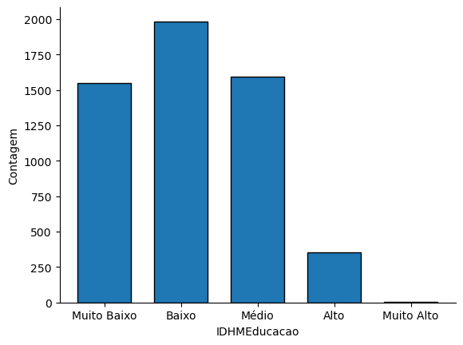

Thus, it can be inferred that there is a significant concentration of records in the lower index categories, indicating that municipalities generally do not have a good HDI.

To simplify the analysis, since the number of objects with the target attribute of the 'Very High' class is in single digits, the municipalities in this category will be merged into the 'High' class and analyzed together.

#### Geographical analysis of municipal HDI

To analyze how the HDI of municipalities in each region is distributed, the bar graph in Figure 2 is used.

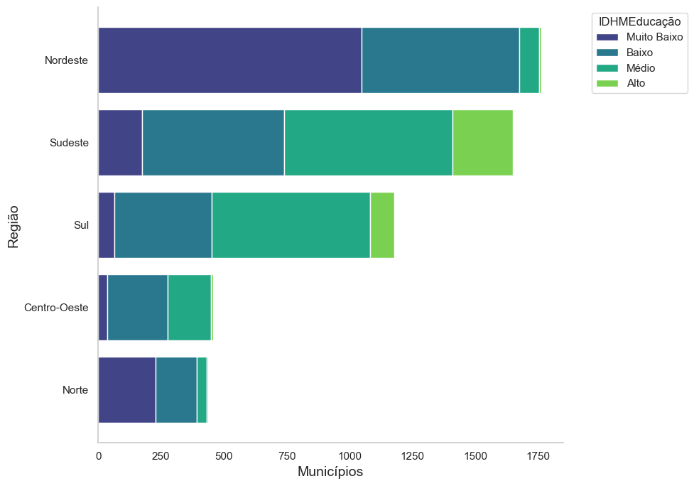

According to the illustration, it can be inferred that, due to the larger number and proportion of municipalities with below-average HDI, the objects from the Northeast region represent the majority of the records with very low or low HDI. Thus, public policies may be more effective if applied with a focus on these municipalities.

Additionally, it is observed that most municipalities with average or above-average HDI are from the South and Southeast regions, a factor that may be related to the high educational rates in these regions. Moreover, the Central-West and North regions show more than half of their municipalities with below-average HDI, which demands attention from the state and the community to mitigate such indicators.

Later, to analyze the relative representation of each region in the categories of the target attribute, the bar graph in Figure 3 is used.

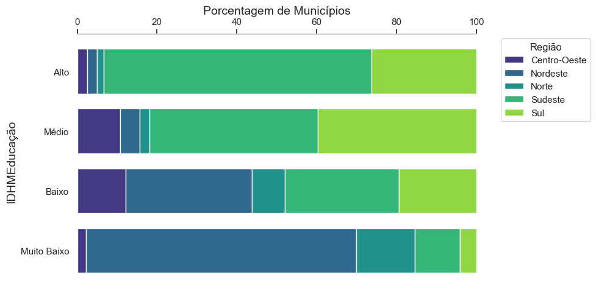

Based on the figure, the analysis reiterates that a large part of the municipalities with average or above-average HDI belongs to the South and Southeast regions, while the objects with below-average indicators are from the Northeast, with a significant share of the Central-West region in the 'Low' and 'Medium' categories, and a considerable portion of records from the North region among the lowest target indicators.

#### Relational analysis between predictive attributes

##### Heatmaps

First, to analyze the correlation of numerical attributes, the correlation table is used, analyzed with two distinct methods, Pearson and Kendall coefficients, along with the corresponding heatmap, available in Figures 4 and 5.

The target attribute was transformed into a numerical order from 1 to 5, from 'Very Low' to 'High', so that the correlation between the column and the rest of the variables could be calculated.

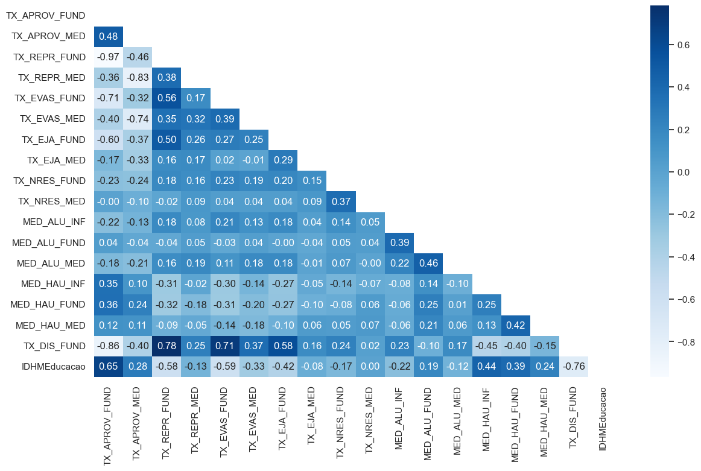

From the Pearson correlation image, it is possible to infer that the target attribute is highly dependent on the age-grade distortion rate and the rates related to elementary education, such as approval, failure, and dropout, indicating a strong relationship between these factors and HDI and their importance. Additionally, regarding the age-grade distortion rate, a relatively high relationship with elementary education rates is observed.

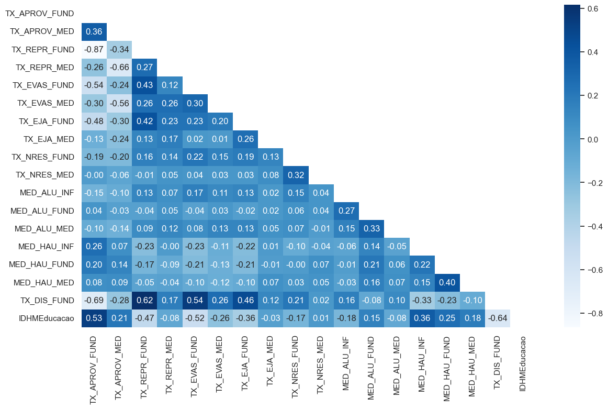

Similar to the Pearson coefficient correlation, analogous relationships can be observed with Kendall's analysis, reiterating the dependencies between the attributes of the dataset.

##### Scatter plots

First, the scatter plots of the rates related to high school and elementary school are observed in Figures 6 and 7.

<figure id="fig:medio">
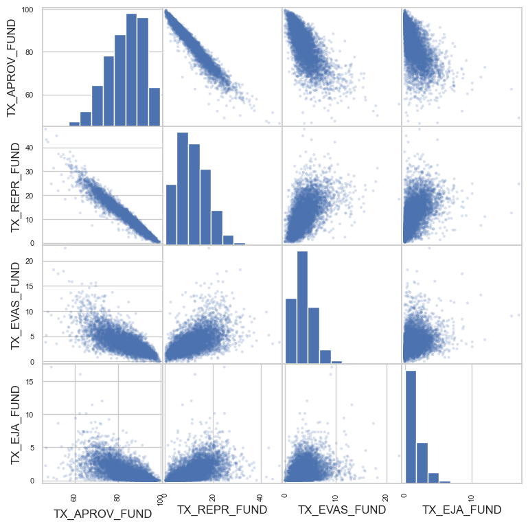
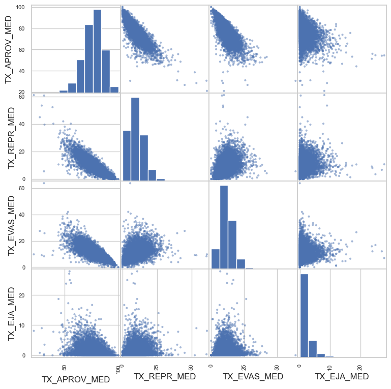
<figcaption>Scatter plots and histograms of high school rates.</figcaption>
</figure>

By considering the scatter plots of attributes for elementary and high school levels, it is inferred that there is a weak linear correlation between the high school attributes, while the elementary school attributes show slightly stronger relationships, especially in the promotion and repetition rates. Therefore, aside from the first two attributes, it is concluded that the attributes at each level are not strongly correlated with each other.

Subsequently, to verify the relationship between the attributes of high school and elementary school with the respective age-grade distortion rates, Figures 7 and 8 are used.

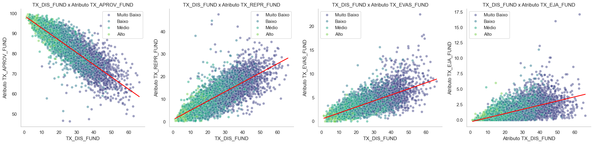

Thus, it is observed that elementary education shows a stronger relationship between rates and distortion.

To verify the hypothesis that the average number of students and class hours in preschool affects the subsequent stages of education, the scatter plots in relation to the age distortion rates are used.

<figure id="fig:dis-inf-med">
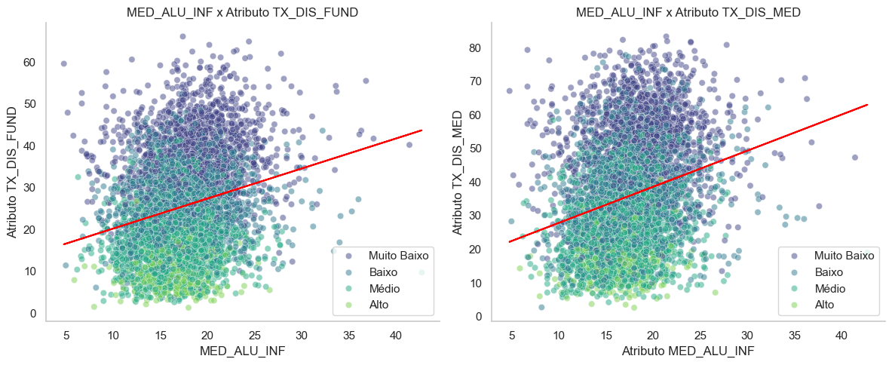
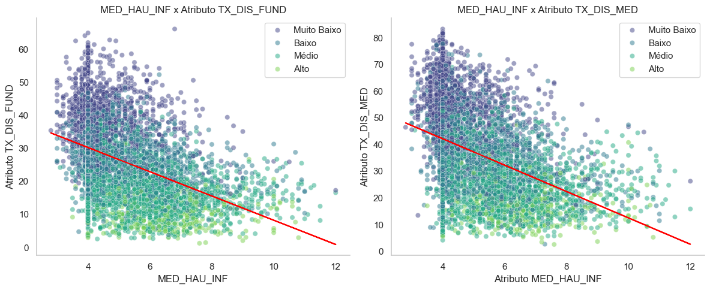
<figcaption>Relationship between the average class hours in preschool and age-grade distortion in elementary school.</figcaption>
</figure>

After visualization, it is reasonable to conclude that the relationship is weak due to the lack of linearity, showing little cause-and-effect proportion between the attributes.

#### Relational analysis between predictive attributes and the target attribute

##### Boxplots

Initially, to verify the correlation between the target attribute and the four initial rates of each education level, boxplots in Figures 10 and 11 are used.

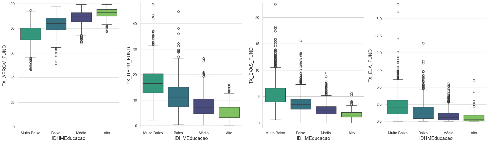

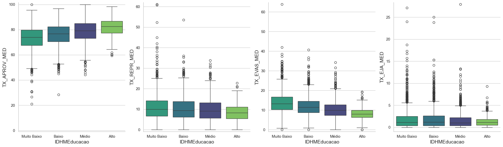

After visualization, it is inferred that the HDI of a municipality is more closely related to elementary education rates compared to high school, due to the higher proportionality between the attributes and less inconsistency, which legitimizes the heatmap addressed earlier.

Then, to verify the relationship between the average number of students and class hours, Figures 12 and 13 are used.

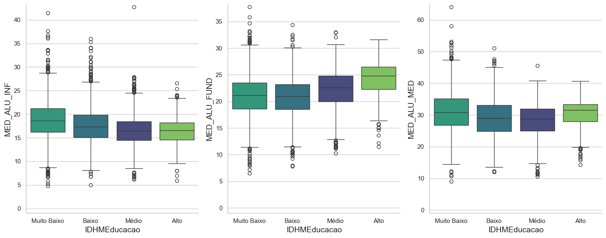

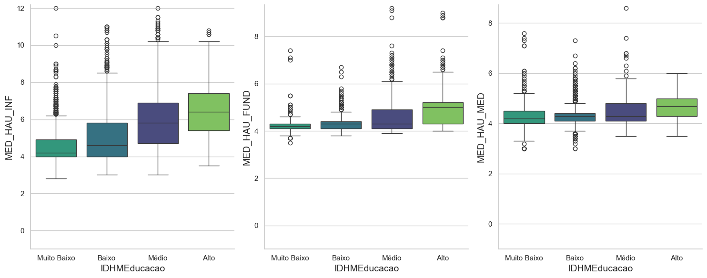

Finally, the relationship between the age-grade distortion rate and the municipal HDI is verified in Figure 14.

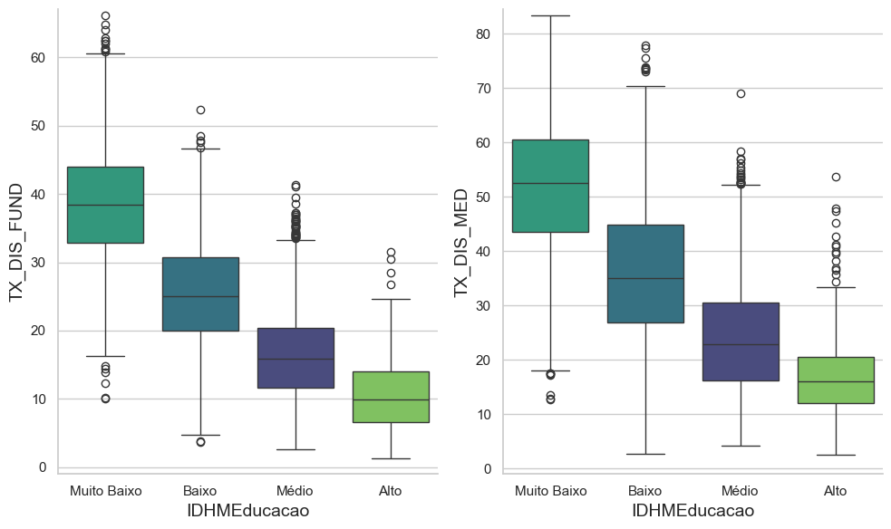

### Conclusion

Therefore, it was possible to infer that, in an imbalanced dataset, the classes with lower HDI have a significantly higher number of representatives.

Regarding geographical analysis, it is observed that the Northeast region stands out as the most disadvantaged in terms of the target attribute, followed by the North and Central-West regions. Conversely, the Southeast and South regions showed a higher proportion of municipalities with average or above-average HDI.

In terms of the correlation of predictive attributes, it is noted that the four initial rates of both educational levels, which are not strongly correlated with each other, are relevant to the age-grade distortion rate, which emerged as a predictive attribute strongly related to the target attribute. Additionally, the rates related to preschool education were not as relevant for estimating the age-grade distortion rate. Furthermore, in the boxplots, it was possible to conclude that the rates for both elementary and high school levels are significant for estimating a municipality's HDI category, with emphasis on elementary education rates. Moreover, the averages of students and class hours showed slight predictive relevance compared to promotion, repetition, dropout, and migration rates, with the average class hours having a closer relationship with linearity. Finally, it was observed that the age-grade distortion rates have a high correlation with the target attribute. It is worth noting that the relationships illustrated in the heatmap were confirmed.

(The analysis was first written in Portuguese.)